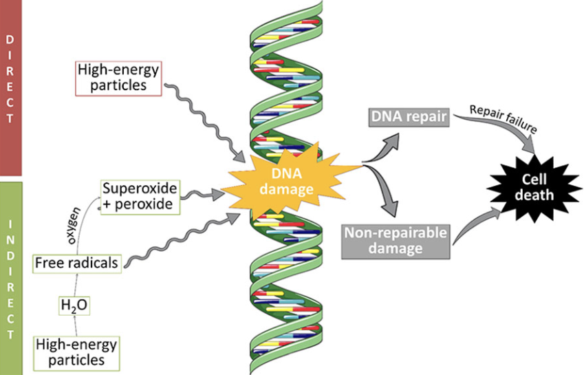
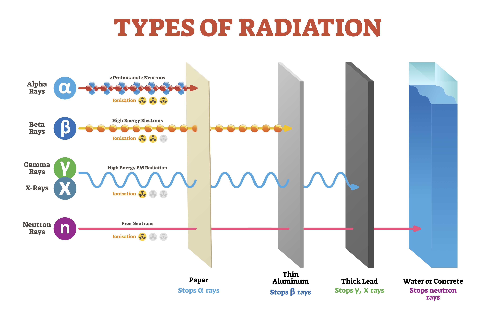
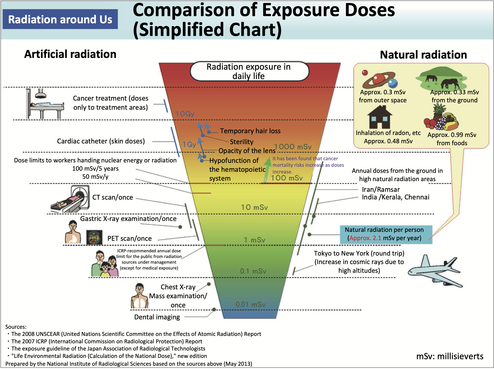

```{r include_packages, include=FALSE}
knitr::opts_chunk$set(echo = FALSE)
# This chunk ensures that the thesisdown package is
# installed and loaded. This thesisdown package includes
# the template files for the thesis.
if (!require(remotes)) {
  if (params$`Install needed packages for {thesisdown}`) {
    install.packages("remotes", repos = "https://cran.rstudio.com")
  } else {
    stop(
      paste('You need to run install.packages("remotes")",
            "first in the Console.')
    )
  }
}
if (!require(dplyr)) {
  if (params$`Install needed packages for {thesisdown}`) {
    install.packages("dplyr", repos = "https://cran.rstudio.com")
  } else {
    stop(
      paste(
        'You need to run install.packages("dplyr")',
        "first in the Console."
      )
    )
  }
}
if (!require(ggplot2)) {
  if (params$`Install needed packages for {thesisdown}`) {
    install.packages("ggplot2", repos = "https://cran.rstudio.com")
  } else {
    stop(
      paste(
        'You need to run install.packages("ggplot2")',
        "first in the Console."
      )
    )
  }
}
if (!require(bookdown)) {
  if (params$`Install needed packages for {thesisdown}`) {
    install.packages("bookdown", repos = "https://cran.rstudio.com")
  } else {
    stop(
      paste(
        'You need to run install.packages("bookdown")',
        "first in the Console."
      )
    )
  }
}
if (!require(thesisdown)) {
  if (params$`Install needed packages for {thesisdown}`) {
    remotes::install_github("ismayc/thesisdown")
  } else {
    stop(
      paste(
        "You need to run",
        'remotes::install_github("ismayc/thesisdown")',
        "first in the Console."
      )
    )
  }
}

library(thesisdown)
library(dplyr)
library(ggplot2)
library(knitr)
library(graphics)
# Set how wide the R output will go
options(width = 70)
```

<!--
The acknowledgments, preface, dedication, and abstract are added into the PDF
version automatically by inputting them in the YAML at the top of this file.
Alternatively, you can put that content in files like 00--prelim.Rmd and
00-abstract.Rmd like done below.
-->

```{r eval=!knitr::is_latex_output(), child=here::here("prelims", "00--prelim.Rmd")}

```

```{r eval=!knitr::is_latex_output(), child=here::here("prelims", "00-abstract.Rmd")}

```

<!-- The {.unnumbered} option here means that the introduction will be 
"Chapter 0." You can also use {-} for no numbers on chapters.
-->
 
# Introduction {.unnumbered}

## Significance
From medicine to insect control, fire alarms to renewable energy, nuclear technology has essential uses across a multitude of industries. In 1911, a young student named George de Hevesy lived modestly in Manchester while studying naturally radioactive materials. When dining with his landlady on a regular basis, he suspected that some meals were prepared with leftovers from many meals before. To test this hypothesis, he sprinkled a small amount of radioactive material into the leftovers, and the next day, found them in his meal using a rudimentary radiation detector. Hevesy went on to win the 1943 Nobel Prize and 1959 Atoms for Peace. This tracing application of radioactive materials is now widely used in industrial, medical, and environmental sciences. [@noauthor_many_nodate] But what about the health risks associated with radiation, one might ask?

Typically, when in close proximity to humans and health, nuclear technology tends to use substances with short half-lives. A half-life is the measurement of characteristic transformation over a period of time. For radioactive isotopes, this is a measurement of initial activity, where half of the initial is gone after the length of time specified as its half-life. [@cember_introduction_1996] Radioactive iodine (I-123) has a half-life of 13 hours, so half of the original activity remains after 13 hours, then three-fourths after 26 hours, and seven-eights gone after 39 hours. This isotope of iodine is often a diagnostic tool for thyroid function, and the 13 hour half-life allows for it to decay quickly and no longer pose radiological dangers. [@iqbal_thyroid_2022] Longer living radioisotopes, such as most naturally occurring uranium (U-238) with a half-life of 4.5 billion years, are used in industries including low-carbon energy, water desalination, and food sterilization. [@cember_introduction_1996] 
As with all industries, hazardous waste needs a place to go and a method of safe disposal. Currently, there are many ways to deal with radioactive waste, such used fuel reprocessing and geological disposal facilities for safe decay. There have been many public doubts to these methods, citing transportation risks, long-term hazards, and emergence in future generations. In transport, radioactive waste is contained within tonnes of radiation- and corrosion-resistant material (such as stainless steel and lead), and typically vitrified so that the waste is immobile, insoluble, and stable for long periods of time. This allows for the materials to decay to the levels at which they were mined, and prevents leakage of contaminants into the environment. Short-term storage and disposal works well for wastes with multiple year half-lives. However, some wastes may need tens to thousands of year before decaying to naturally-occurring activity, which leads to issues of security and accessibility as time passes. [@noauthor_many_nodate] 

Enter one of many solutions: the radioresistant microbe. Even in the most barren of places, bacteria can be found growing, maybe even thriving. If the world were explode and end, there would still probably be bacteria floating around just because they’re so persistent. Thus, unsurprisingly, bacteria have been found in nuclear disaster sites such as Three Mile Island and Chernobyl. [@zhdanova_ionizing_2004] Since initial considerations of radioresistant bacteria in industrial uses in 1996 [@binks_radioresistant_1996], bacteria have been used to precipitate uranium contamination from groundwater [@cologgi_extracellular_2011] and reduce the oxidation state of uranium for metal leeching uses [@koribanics_spatial_2015]. Using radioresistant bacteria, decay and disposal of radioactive waste can be fast-tracked, and thousand-year storage can be avoided. 

## Radioresistant Spotlight

So what is radioresistance? Radioresistance refers the level of ionizing radiation an organism can withstand. High levels of radioresistance are often found among insects, worms, plants, and certain extremophiles such as _Deinococcus radiodurans_ (D. rad) and tardigrades. To give a reference point, a lethal dose of radiation to humans is between 4-10 Grays, whereas D. rad can withstand up to 15,000 Grays. Of course, there’s a lot more complexities to the human body than to the single celled bacteria, but that is still many magnitudes more radiation in comparison. [noauthor_radiochemistry_nodate]

The biological effects of radiation have also been thoroughly studied since the atomic bombings in World War II. Scientists have found various different stochastic or deterministic effects, where a certain minimum dose of radiation is needed or the effect occur by chance, respectively. Radiation, ionization, and excitation can directly effect any part of the body, such as damaging specific protein molecules or nucleic acids. However, organisms mostly consist of water, so radiation directly mutating a single nucleic acid is rare. Instead, most radiation directly interacts with water, and the energy absorbed by the water creates highly reactive free radicals, which contain unpaired electrons (Figure \@ref(fig:radiationDNA)). The unpaired electrons make free radicals highly reactive and chemically toxic to other molecules, in this case, other waters and free radicals. One possible chemical reaction is as follows:

\begin{align*}
  &\mathrm{H_{2}O} \longrightarrow \mathrm{H_{2}O^{+} + e^-}   \qquad \text{First water molecule is irradiated} \\
  &\mathrm{H_{2}O^+} \longrightarrow \mathrm{H^{+} + OH}       \qquad \text{Positive ion dissociates} \\
  &\mathrm{H_{2}O + e^-} \longrightarrow \mathrm{H_{2}O^-}     \qquad \text{Electron is picked up by water molecule} \\
  &\mathrm{H_{2}O^-} \longrightarrow \mathrm{H + OH^-}         \qquad \text{Hydronium ion dissociates} \\
  &\mathrm{OH + OH} \longrightarrow \mathrm{H_{2}O_{2}}        \qquad \text{Hydrogen peroxide is formed} 
  (\#eq:reaction)
\end{align*}


The resulting hydrogen peroxide is a powerful oxidizing agent, and can thus affect molecules or cells that were not initially affected by radiation. While all organisms have some form of DNA or macromolecule repair mechanisms, most are not equipped for large scales of damage. Radiation damage is irreversible, so unless the damaged cells are quickly replaced by healthy ones, this can lead to the demise of organisms. [@cember_introduction_1996] 


```{r radiationDNA, out.width = '100%', fig.align='center', fig.cap='Interaction of radiation and DNA, adapted from Przystupski et al.'}

```

In 1956, the discovery of D. rad as a contaminant in radiation-sterilized corned beef cans brought about DNA-centered molecular biology [@krisko_biology_2013]. Radiosensitivity varies between quiescent and slow dividing cells versus cells with high proliferation rates. Like with growth-arrested bacteria and antibiotics, quiescent and slow dividing cells are less radiosensitive. Growth-arrested bacteria inactivate antibiotic targets, allowing the cells to remain dormant until the threat has passed. In slow growing cells, DNA repair mechanisms have the time to repair damage many times more than in standard growing species, allowing them to make sure every new cell is well-made. For example, D. rad is just as radiosensitive as many other bacteria, but due to its investment in efficiency of survival over growth, not only does it present spectacular DNA repair capacity for radioresistance, but also resistance to desiccation [@krisko_biology_2013]. Other organisms studied for radioresistance include _Escherichia coli_ (_E. coli_), a less radioresistant bacteria found to produce resistant mutants based on environmental conditions and physiological factors, and melanin rich fungus found at the Chernobyl disaster site better protected against UV, solar, and ionizing radiation than its less pigmented relatives [@witkin_inherited_1946, @dadachova_ionizing_2007]. 

But as with any antibacterial method, extremophiles will form. Highly radioresistant strains of bacteria have been generated and found many times in environmental and laboratory settings. [@bruckbauer_experimental_2021] In addition to that, there is also potential for microbial diversity induced by low levels of ionizing radiation to use as bioregenerative life support systems. [@yang_microbial_2021]  The study of these radioresistant bacteria and their robust cellular repair mechanisms are crucial for opening new doors in medicine, sustainability, and industry. 

## The Reed Research Reactor

Let’s make this more local. Welcome to Reed College, we have a cute little tourist point call the Reed Research Reactor (RRR). It’s a Training, Research, Isotopes, General Atomics (TRIGA) Mark I reactor built in 1968 by General Atomics primarily used for research and education. We’re proudly the only nuclear reactor in the world that is owned and run by an exclusively undergraduate college. On the scale of reactors, it’s small, underfunded, but well loved by the staff and community. Operators are officially licensed by the Nuclear Regulatory Commission (NRC), but since we’re a non-profit educational institution, we’re paid minimum wage. 

Why do we have a reactor anyway? Reed does not have engineering as a major, much less nuclear engineering. Well you see, it all started with a murder. In 1934, Professor of Chemistry Ralph Kempton Strong left after accusations of murdering his wife arose, and Arthur F. Scott become a professor of chemistry at Reed in 1937. Scott’s specialty was radiochemistry, and with the support from the Atomic Energy Commission (which has since been transformed into the NRC) eventually installed the reactor in 1968 [Ellis]. Since then, hundreds of students have been licensed, and hundreds of experiments have been conducted to their individual interests. Commonly mentioned experiments include irradiation of zebrafish, frog cells, fingernails, and archaeological artifacts to observe the effects of radiation on organism development and trace elements found in composite materials, respectively [gee_effects_2020].

Let’s do a quick crash course on radiation and health physics. Sometimes, atomic nuclei find themselves in unstable configurations due to energy imbalances or particle interactions. This instability makes the atom radioactive, so to relax and stabilize, the nucleus undergoes a process to lose energy by ejecting smaller particles or rearranging the protons and neutrons. The smaller particles containing energy are called radiation, and the process is radioactive decay. There are three types of ionizing radiation: alpha, beta, and gamma. Alpha particles are essentially a helium atom without electrons, composed of two protons and two neutrons. It’s the heaviest of the three molecules, so it won’t travel very far but will do a lot of damage if it gets to an unprotected area. This type of radiation is easiest to shield against—even the dead layer of cells covering your skin will do. Beta particles are similar to electrons, but ejected from the nucleus of an atom to turn a proton into a neutron, or absorbed to do the opposite. It’s much lighter than the alpha particle, and can travel a little further, and need low atomic mass materials such as several inches of wood, plastic, or a sheet of aluminum foil to stop them. Lastly, gamma radiation is pure energy, completely mass-less. It can easily make its way through materials and needs a good amount of lead or concrete to shield it. Outside of ionizing radiation is neutron radiation. These particles don’t ionize other atoms, instead the target can be made radioactive through a process called neutron activation to release one of three above ionizing radiations. Due to their neutral charge and lack of ionizing capabilities, neutrons are difficult to directly detect using typical hand-held radiation detectors such as Gieger-Mullers, and instead need various calculations or different instruments to accurately measure. To protect ourselves from them, we need three layers: one to slow it down (water), one to absorb it (boron), and one to shield from the resulting gammas released (concrete).

```{r typesOfRadiation, fig.cap = 'Interaction of radiation and DNA, reprinted from American Nuclear Society.', out.width = '100%', fig.align='center'}

```

Why do we even want to shield ourselves from radiation? Atoms make up everything, so when the stability of an atom is disrupted, it can be like pulling the wrong piece out of a precariously balanced stack of blocks. In your body, the ionization radiation interacts mostly with water, which results in an unpaired election called free radical. This free radical is extremely reactive, so the slightly negatively charged water molecule will try to interact with anything it’s close to, and since the body is 70% water, there will be a lot of free radicals to mess with the status quo as mentioned previously. Tucked behind both a cell and nucleus membranes in eukaryotic cells is the vital molecule, deoxynucleic acid (DNA). DNA is the first component to the central dogma of biology, where it acts as the blueprint for the production of all other things—from proteins, to cells, tissue, organs, and organisms. Ionizing radiation and its results can destabilize membranes and the charged particles will interact with the DNA, causing base and sugar damage, single stranded breaks, and double stranded breaks. Double stranded breaks are often the most lethal, as chromosomal rearrangement can occur, repair is slow, and cell death or delayed mitosis can result. While there are many cell mechanisms that exist to repair these dangers, there can be too much damage and not enough time to effectively save the cell and its progeny. 

Oh no, radiation sounds so scary! If I’m irradiated, can I turn into a non-trademarked superhero? Absolutely not. You might just die. Also, radiation is all around you! It’s constantly emitted from sources such as the sun, the air, the ground, building materials, and even your food [@shahbazi-gahrouei_review_2013]. A higher dose of radiation is receive on an airplane ride than the dose received while working at the reactor for the same amount of time. There is no escape.

```{r dailyRadiation,  fig.cap = 'Interaction of radiation and DNA, reprinted from Ministry of the Environment, Government of Japan', out.width = '100%', fig.align='center'}

```


## So what am I doing here?

Well. The RRR core is situated in a 25000 gallon tank of filtered, demineralized water for optimal clarity and shielding for the various types of radiation. So with all the filtration and radiation, the reactor water should be pretty clean… right?
Remember those extremophiles? Bacteria can survive off of just about anything, so even though there may not be explicit food for them in the water, there’s plenty of materials that make up the reactor system itself. A study performed at the Three Mile Island nuclear power plant and the spent nuclear fuel pools of the Cofrentes nuclear power plant in Valencia, Spain, observed microbial growth living in ultra-pure, radioactive water. The nuclear industry started to devote attention to microbiological influenced corrosion of surfaces, but due to the belief that gamma radiation from the reactor fuel would effectively sterilize environments, the studies have been all but forgotten [@chicote_isolation_2005]. 

Inspired by Radioresistant microbes in the Reed Research Reactor (D. Dashevsky, Microbiology Lab Poster, Reed College, 2014), a short study by former microbiology student and reactor operator Daniel Dashevsky, we will isolate and identify bacteria from the primary filtration system of the Reed Research Reactor. In their project, Dashevsky isolated _Pseudomonas fluorescens_ (_P. fluorescens_) from the reactor systems that demonstrated radioresistance. In Spring of 2021, samples were collected from various parts of the Reed Research Reactor (RRR) primary filtration system using sterile swabs and nutrient agar plates. Sampling areas included the primary filter and housing, the pool floor, the pool walls, poolside fuel racks, and the top of the core. While many strains of bacteria were isolated from the initial sampling of the RRR primary filtration system, only 5 strains from the primary filter (1°F1 - 5) were used for the irradiation in addition to the three controls: Dra, the radioresistant positive control; DDev, the RRR isolated radioresistant positive control; _Escherichia coli_ ( _E. coli_ ) DH5-$\alpha$, the radiosensitive negative control. Overnight growths of these exposed to a dose of 877 µGy using a Cesium-137 source [insert activity] plated to observe differences in growth between irradiated and non-irradiated samples. 

The result of this preliminary study reveal the potential of these bacteria and the RRR experimental systems to research radioresistant microorganisms. While the conclusions drawn from the study themselves do not reveal much, it allowed for experimental methods to be developed and refined for this thesis. In continuing the work, I have since found 3 strains of radioresistance _Bacillus_ species through UV irradiation and 16S analysis. Using the experimental facilities of the RRR, I hope to test and observe the hypothesis that the strains of radioresistant bacteria I find will contain robust DNA repair genes compared to standard lab strains to explain the basis of their radioresistance.


**For additional help with bookdown** 

Please visit [the free online bookdown reference guide](https://bookdown.org/yihui/bookdown/).
